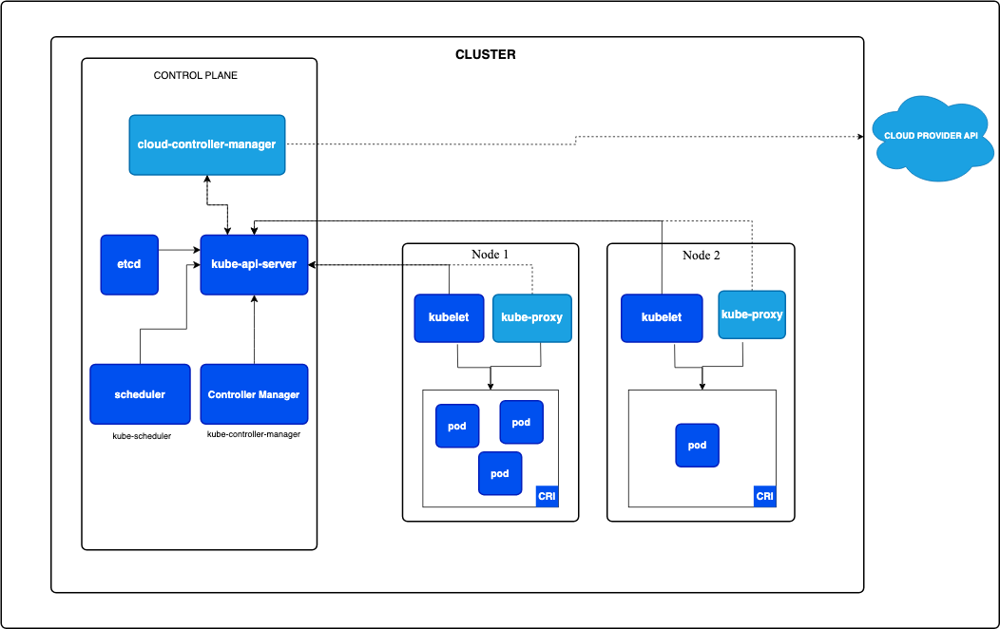
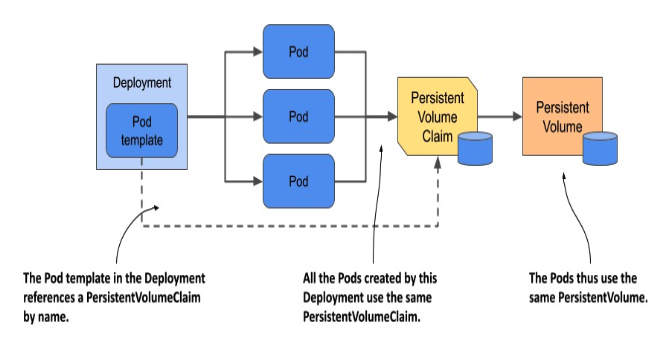
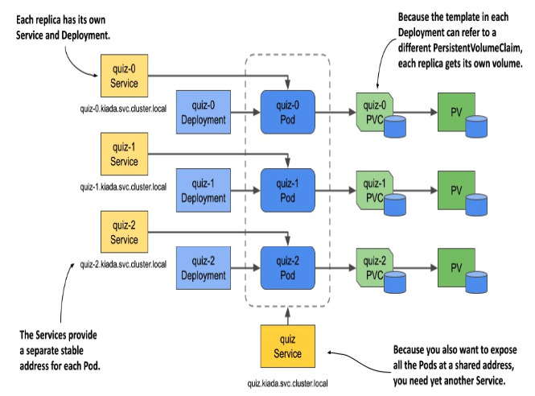

### What is the architecture of a minimal Kubernetes cluster?
- minikube start --nodes 2
- kubectl get nodes
- Lens/OpenLens
  - check containers



Source: https://kubernetes.io/docs/concepts/architecture/

### What is the difference between Deployment and StatefulSet kubernetes object?
- StatefulSet:
  - Stable network identity
  - Persistent volume templates (each has its own)
  - Order of creation, replace, deletion is predictable

Deployment:



Source: Kubernetes in Action by Marko Luksa

StatefulSet:



Source: Kubernetes in Action by Marko Luksa

### What is a Service kubernetes object responsible for?
- Types:
  - ClusterIP
  - NodePort
  - LoadBalancer
  - ExternalName
  - (Headless)


NodePort in Minikube:
```sh
minikube service <service-name> --url
```

LoadBalancer in Minikube:
```sh
minikube tunnel
```

### How can be a kubernetes pod reached from the public internet?

### What is the difference between LivenessProbe and ReadinessProbe?

### What is the difference between resource Limit and Request?
